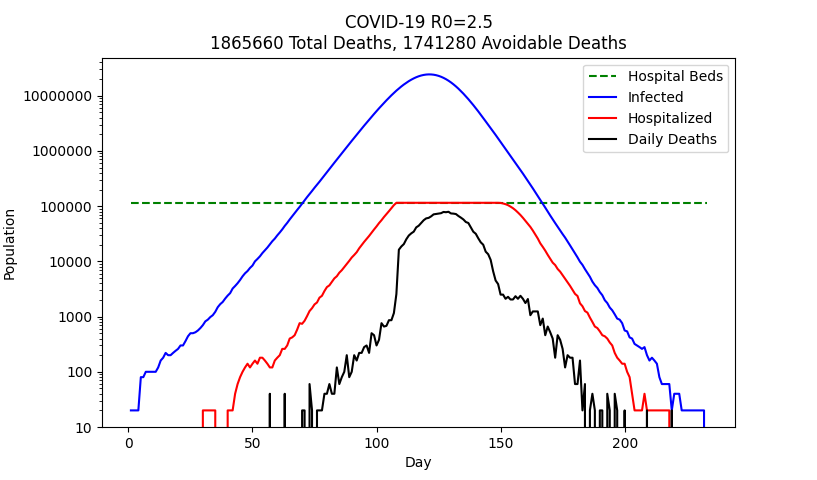
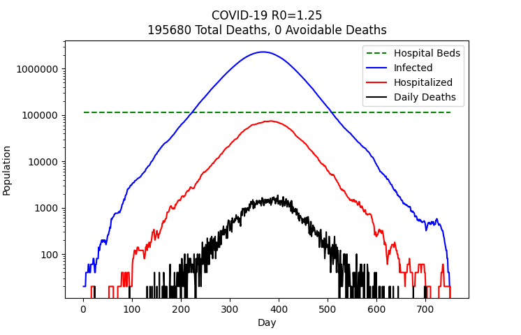

# COVID-19 Simulation

**This is just a simulation attempt. Please take it with a pinch of salt.**

### Parameters
- population size: **UK** (66m)
- R0 (reproduction number): **2.5** (no social distancing) and **1.25** (with social distancing)
- latent period (non-infectious period): **2 days** on average
- communicability (infectious period): **10 days** on average
- hospitalization rate: **4%**
- hospitalization period: **10 days** on average
- hospital death rate: **20%**
- number of hospital beds: **115k**

- 90% of population got infected during the simulation

- 37% of population got infected during the simulation
